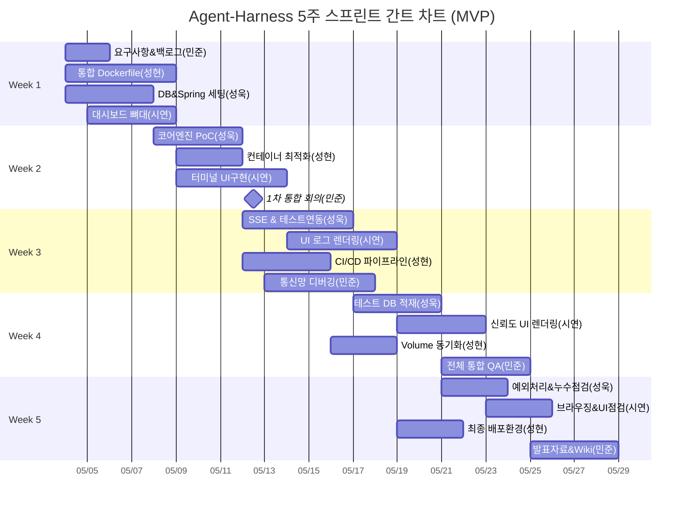

# 📅 팀 R&R 및 WBS 개발 일정표

과제 평가 기준을 충족하고 5주라는 짧은 기간 내에 MVP를 완성하기 위해, GitHub Projects(Kanban)를 활용한 스프린트 방식으로 병렬 개발을 수행합니다.

## 1. 상세 역할 분담 (R&R)

- **박민준 (Team Leader / PM & System Architect)**
  - 프로젝트 총괄, WBS 관리 및 칸반 보드 태스크 트래킹
  - 시스템 아키텍처 설계 (SSE, ProcessBuilder 도입 결정)
  - TADD 코어 루프 시나리오 명세 작성 및 파트별 통합 QA 주도
  - 과제 보고서, GitHub Wiki 관리 및 데모 시연 주도
  - 단위 테스트(pytest) 코드 작성 및 GitHub 커밋 (Docs as Code)
  - 파이썬 로그 파싱 정규식 및 테스트 실행 래퍼 스크립트 개발
  - 초기 DB 세팅용 init.sql 및 더미 데이터(Mock JSON) 제작

- **장성욱 (Backend Core Engineer)**
  - Spring Boot 기반 백엔드 아키텍처 및 코어 로직 전담
  - ProcessBuilder를 활용한 AI 프로세스 제어(실행, 종료) 및 로그 파싱 연동
  - 에이전트 종료 이벤트 감지 후 단위 테스트 자동 실행 트리거 구현
  - PostgreSQL 스키마 설계, JPA 연동 및 REST API / SSE 엔드포인트 구축

- **김시연 (Frontend Engineer & UI/UX)**
  - Vanilla JS, TailwindCSS 기반 실시간 관제 대시보드 마크업/로직 구현
  - SSE 커넥션을 통한 가상 터미널 UI 실시간 스트림 렌더링
  - 테스트 결과 및 토큰 사용량 데이터를 Chart.js로 시각화
  - 멀티 에이전트 플릿 더미 레이아웃 설계

- **김성현 (DevOps & Infrastructure Engineer)**
  - Spring, Node.js, AI CLI 통합 Docker Runner 컨테이너 구축
  - 호스트-컨테이너 간 Volume Mount 디렉토리 동기화 세팅
  - GitHub Actions 활용 CI/CD 파이프라인 구축
  - 레포지토리 관리, PR 템플릿 세팅 및 머지 충돌 관리

---

## 2. 5주 단위 마일스톤 및 WBS 일정

### 2.1. 주차별 마일스톤 목표
- **[Week 1] 기반 구축:** DB 스키마 설계, Spring Boot 초기 설정, 통합 Dockerfile 작성
- **[Week 2] 코어 엔진 개발:** 단일 ProcessBuilder 실행 엔진 구현 및 로그 실시간 파싱 PoC
- **[Week 3] 검증 파이프라인:** 에이전트 프로세스 종료 감지 ➔ 단위 테스트 자동 실행 ➔ DB 적재 연동
- **[Week 4] 시각화 및 UI 연동:** 대시보드 구축 및 REST API/SSE 기반 백-프론트 데이터 통합
- **[Week 5] 최종화:** 통합 테스트, 버그 픽스, 예외 처리 고도화, GitHub Wiki 문서화 및 데모 준비

### 2.2. 상세 WBS 태스크 보드
| Task ID | 분류 | 태스크명 (작업 내용) | 담당자 | 기간 | 우선순위 |
| :--- | :--- | :--- | :--- | :--- | :--- |
| W1-01 | PM | 요구사항 명세, 백로그 세팅, 깃허브 협업 규칙 확립 | 박민준 | 2일 | 🔴 높음 |
| W1-02 | 인프라 | 통합 Dockerfile 초안 작성 및 로컬 실행 테스트 | 김성현 | 3일 | 🔴 높음 |
| W1-03 | 백엔드 | Spring Boot 초기화, PostgreSQL 스키마 & JPA 엔티티 | 장성욱 | 4일 | 🔴 높음 |
| W1-04 | 프론트 | 대시보드 와이어프레임 확정 및 정적 HTML/CSS 뼈대 | 김시연 | 4일 | 🟡 중간 |
| W1-05 | PM | UI 더미 JSON 및 DB 초기화 init.sql 작성/커밋 | 박민준 | 1일 | 🔴 높음 |
| W2-01 | 백엔드 | ProcessBuilder 이용 CLI 로컬 실행 및 콘솔 출력 PoC | 장성욱 | 4일 | 🔴 높음 |
| W2-02 | 인프라 | AI 에이전트 설치 및 버퍼링 해제 최적화 | 김성현 | 3일 | 🔴 높음 |
| W2-03 | 프론트 | 가상 터미널 UI 마크업 및 텍스트 자동 스크롤 로직 | 김시연 | 5일 | 🟡 중간 |
| W2-04 | PM | 진척도 점검 및 1차 시스템 통합 방안 회의 주도 | 박민준 | 1일 | 🔴 높음 |
| W2-05 | PM | 로그 파싱 정규식 및 테스트 래퍼 파이썬 스크립트 | 박민준 | 2일 | 🟡 중간 |
| W3-01 | 백엔드 | 터미널 로그 SseEmitter 연동 및 자동 실행 트리거 | 장성욱 | 5일 | 🔴 높음 |
| W3-02 | 프론트 | 백엔드 SSE 연동하여 터미널 UI 실시간 로그 렌더링 | 김시연 | 5일 | 🔴 높음 |
| W3-03 | 인프라 | GitHub Actions 기반 CI/CD 파이프라인/Lint 자동화 | 김성현 | 4일 | 🟡 중간 |
| W3-04 | PM | 백-프론트 실시간 통신망 디버깅 지원 | 박민준 | 5일 | 🔴 높음 |
| W4-01 | 백엔드 | 테스트 결과 파싱 및 DB 영구 저장 로직 구현 | 장성욱 | 4일 | 🟡 중간 |
| W4-02 | 프론트 | 누적 데이터 기반 신뢰도 점수/차트 및 더미 슬롯 | 김시연 | 4일 | 🟡 중간 |
| W4-03 | 인프라 | Volume Mount를 통한 파일 동기화 점검 | 김성현 | 3일 | 🔴 높음 |
| W4-04 | PM | TADD 전체 사이클 통합 QA 진행 | 박민준 | 4일 | 🔴 높음 |
| W4-05 | PM | 요구사항에 따른 검증용 pytest 테스트 코드 작성 | 박민준 | 3일 | 🔴 높음 |
| W5-01 | 백엔드 | 스트림 리소스 누수 점검 및 예외 처리 고도화 | 장성욱 | 3일 | 🟡 중간 |
| W5-02 | 프론트 | UI 반응성 개선 및 크로스 브라우징 체크 | 김시연 | 3일 | 🟢 낮음 |
| W5-03 | 인프라 | 최종 빌드 이미지 최적화 및 배포 환경 점검 | 김성현 | 3일 | 🟡 중간 |
| W5-04 | PM | 기술 Wiki 작성, 데모 시나리오 확정 및 발표 준비 | 박민준 | 4일 | 🔴 높음 |

### 2.3. 개발 일정 간트차트

---

## 3. 리스크 관리 및 대응 전략 (Risk Mitigation)
| 리스크 유형 | 예상되는 문제 상황 (Risk) | 대응 전략 (Mitigation & Plan B) |
| :--- | :--- | :--- |
| **기술적 리스크** | AI 프로세스가 무한 대기(Hang) 상태에 빠져 자원 점유 | Timeout(30초) 설정, 초과 시 강제 종료(`destroy()`) 및 에러 반환 구현 |
| **일정 리스크** | 5주 내 ProcessBuilder와 UI(SSE) 완전한 통합 실패 | 3주 차 판단 시 실시간 연동 포기, 결과만 폴링(Polling)하는 모델로 피벗 |
| **환경 리스크** | 팀원 간 로컬 OS 차이(Mac/Win)로 인한 빌드 오류 | 초기부터 '통합 Docker 컨테이너' 내부에서만 실행하도록 형상 관리 강제 |

---

## 4. 팀 협업 및 형상 관리 규칙 (Team Convention)
- **회의체 운영 (Communication):**
  - 매주 수요일 오후 9시 Discord 주간 스프린트 회의 (이슈 트래킹 및 목표 설정)
  - 기술적인 Blocker 발생 시 단톡방에 즉각 공유하여 개발 지연 방지
- **버전 관리 및 배포 전략 (Git/GitHub):**
  - GitHub Flow 채택, `main` 브랜치 직접 Push 엄격히 금지
  - 기능 개발 시 반드시 `feature/기능명` 브랜치 생성 후 작업
  - 모든 코드는 PR(Pull Request)을 통해 병합, 최소 1명 이상의 팀원 리뷰 및 PM의 Approve 필수