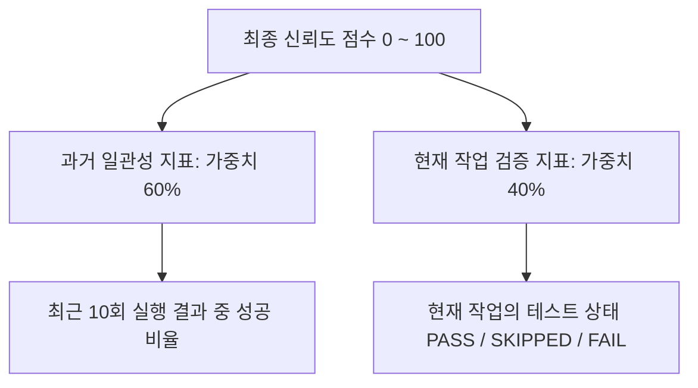

# 📊 AI 에이전트 신뢰도 점수(Reliability Score) 명세서

본 문서는 **Agent-Harness** 플랫폼이 AI 코딩 에이전트의 수행 능력을 객관적으로 수치화하기 위해 사용하는 **신뢰도 점수(Confidence Score)**의 산출 로직과 계산 예시를 쉽게 정리한 가이드입니다.

---

## 1. 신뢰도 점수란 무엇인가요? (Overview)

AI 코딩 에이전트가 작성한 소스 코드는 문법적으로 맞아 보이더라도 논리적 결함이나 테스트 에러를 발생시킬 수 있습니다.  
Agent-Harness는 에이전트가 작성한 결과물의 **과거 안정성(일관성)**과 **현재 작업의 완결성**을 종합적으로 연산하여 **0부터 100 사이의 점수**로 환산합니다.

이 점수는 대시보드 화면의 **"Reliability Score"** 영역에 실시간으로 시각화되어 사용자가 에이전트의 현재 역량을 직관적으로 이해할 수 있도록 돕습니다.

---

## 2. 점수 산출 공식 (Scoring Formula)

신뢰도 점수는 아래의 **하이브리드 가중 공식**을 통해 구해집니다.

$$\text{Confidence Score} = (\text{최근 10개 작업 성공률} \times 0.6) + (\text{현재 작업 상태 점수} \times 0.4)$$



### 지표 ①: 최근 성공률 (성공 이력 비율) — 60% 반영
*   **목적:** AI 에이전트가 평소에 얼마나 지속해서 성공적인 산출물을 냈는지 평가 (일관성 측정)
*   **대상:** 최신 작업 이력 최대 10개 (`task_results` 테이블 조회)
*   **공식:** 
    $$\text{최근 성공률 (\%)} = \left( \frac{\text{성공한 작업 수}}{\text{최근 조회된 전체 작업 수}} \right) \times 100$$
    *(※ 아직 실행 이력이 전혀 없는 극 초기 상태일 때는 성공률을 100%로 지정합니다.)*

### 지표 ②: 현재 작업 상태 점수 — 40% 반영
*   **목적:** 이번 작업이 테스트 스크립트를 완벽하게 통과했는지 혹은 에러가 났는지 즉각 반영 (완결성 측정)
*   **상태별 매핑 점수 테이블:**
    | 테스트 상태 (testStatus) | 매핑 점수 (Status Score) | 상세 설명 |
    | :--- | :---: | :--- |
    | **`PASS`** | **100점** | 모든 `pytest` 단위 테스트 검증 통과 |
    | **`SKIPPED`** | **80점** | 코드 수정 사항이 없어 검증 단계를 생략함 (보통 점수 보장) |
    | **`FAIL`** | **30점** | 테스트 검증 실패 혹은 컴파일/구문 에러 발생 |
    | **기타 / 에러** | **0점** | 프로세스 강제 종료 등 알 수 없는 중단 |

---

## 3. 시나리오별 점수 계산 예시 (Examples)

### 🟢 시나리오 A: 지속적으로 작업을 완벽하게 수행하는 우수 에이전트
*   **DB 최근 10개 이력:** 10회 중 9회 성공 (`성공률 90%`)
*   **현재 작업 결과:** `PASS` (`100점`)
*   **계산 과정:**
    *   `과거 지표(60%):` $90 \times 0.6 = 54\text{점}$
    *   `현재 지표(40%):` $100 \times 0.4 = 40\text{점}$
    *   `최종 계산:` $54 + 40 = 94$
*   👉 **최종 신뢰도:** **`94점`** (우수한 신뢰 수준)

### 🟡 시나리오 B: 우수했으나 직전 테스트에 실패하여 경고가 필요한 에이전트
*   **DB 최근 10개 이력:** 10회 중 9회 성공 (`성공률 90%`)
*   **현재 작업 결과:** `FAIL` (`30점`)
*   **계산 과정:**
    *   `과거 지표(60%):` $90 \times 0.6 = 54\text{점}$
    *   `현재 지표(40%):` $30 \times 0.4 = 12\text{점}$
    *   `최종 계산:` $54 + 12 = 66$
*   👉 **최종 신뢰도:** **`66점`** (과거 기록이 좋아도 직전 실패로 점수가 하락함)

### 🔴 시나리오 C: 과거 잦은 실패 후 겨우 테스트를 통과한 불안정한 에이전트
*   **DB 최근 10개 이력:** 10회 중 2회 성공 (`성공률 20%`)
*   **현재 작업 결과:** `PASS` (`100점`)
*   **계산 과정:**
    *   `과거 지표(60%):` $20 \times 0.6 = 12\text{점}$
    *   `현재 지표(40%):` $100 \times 0.4 = 40\text{점}$
    *   `최종 계산:` $12 + 40 = 52$
*   👉 **최종 신뢰도:** **`52점`** (이번에는 통과했으나 과거의 잦은 실패로 인해 보수적인 수준으로 억제됨)

---

## 4. 백엔드 소스 코드 참조 (Code References)

*   **점수 계산 메서드 위치:**
    [ProcessOrchestratorService.java](file:///c:/Users/장성욱/Desktop/ws/OSP_Project/backend/src/main/java/com/agent/harness/service/ProcessOrchestratorService.java#L282-L321)의 `calculateConfidenceScore(TaskResult)`
*   **최근 10개 조회 쿼리 위치:**
    [TaskResultRepository.java](file:///c:/Users/장성욱/Desktop/ws/OSP_Project/backend/src/main/java/com/agent/harness/repository/TaskResultRepository.java#L8)의 `findTop10ByOrderByIdDesc()`

---

## 5. 실시간 Mock 에이전트 구동 및 신뢰도 검증 (Mock Agent Run & Verification)

로컬 개발 및 테스트 환경에서 에이전트 동작에 따른 신뢰도 점수 갱신을 검증하기 위한 가이드입니다.

### OS 호환성 및 파일 경로 처리
*   **OS 호환성:** 백엔드는 실행 중인 운영체제를 감지하여 윈도우 환경에서는 `python`, 리눅스/맥 환경에서는 `python3` 명령어를 동적으로 선택하여 구동합니다.
*   **상대 경로 해결:** 작업 디렉토리가 `workspace/`로 격리되어도, 프롬프트 인자로 들어오는 `.log` 파일 경로(예: `scripts/dummy_logs/modify_pass.log`)는 백엔드가 자동으로 프로젝트 루트 폴더 기준의 절대 경로로 보완하여 파이썬 래퍼 스크립트에 전달합니다.

### 검증 시나리오 진행 단계

1.  **로컬 DB 및 백엔드 실행**
    ```cmd
    # 1. PostgreSQL 컨테이너 기동 (infra/ 폴더 혹은 루트에서 경로 지정)
    docker-compose -f infra/docker-compose.yml up -d postgres

    # 2. 백엔드 Spring Boot 구동
    cd backend
    gradlew bootRun
    ```

2.  **데이터베이스 초기화 (선택 사항)**
    *   기존 실패/성공 이력을 모두 지우고 100점부터 깔끔하게 계산을 테스트해보고 싶다면 아래 SQL 명령어를 실행하여 데이터를 리셋합니다.
    ```cmd
    docker exec -it postgres psql -U postgres -d agent_harness -c "TRUNCATE TABLE task_results CASCADE; TRUNCATE TABLE agent_tasks CASCADE;"
    ```

3.  **Mock 에이전트 테스트 요청 (POST API 호출)**
    *   윈도우 `CMD` 창에서는 큰따옴표 이스케이프(`\"`)가 필수입니다. 아래 명령어를 사용해 더미 로그 시나리오를 구동합니다.

    *   **테스트 통과 (`PASS` / 현재 상태 100점):**
        ```cmd
        curl -X POST http://localhost:8090/api/v1/agent/run-test -H "Content-Type: application/json" -d "{\"prompt\": \"scripts/dummy_logs/modify_pass.log\"}"
        ```
    *   **테스트 실패 (`FAIL` / 현재 상태 30점):**
        ```cmd
        curl -X POST http://localhost:8090/api/v1/agent/run-test -H "Content-Type: application/json" -d "{\"prompt\": \"scripts/dummy_logs/modify_fail.log\"}"
        ```
    *   **코드 변경 없음 (`SKIPPED` / 현재 상태 80점):**
        ```cmd
        curl -X POST http://localhost:8090/api/v1/agent/run-test -H "Content-Type: application/json" -d "{\"prompt\": \"scripts/dummy_logs/no_modify.log\"}"
        ```

4.  **최종 결과 및 신뢰도 점수(confidenceScore) 조회**
    *   테스트 프로세스가 완료된 후 다음 API를 조회하여 산출된 결과를 눈으로 직접 확인합니다.
    ```cmd
    curl http://localhost:8090/api/v1/agent/latest-result
    ```
